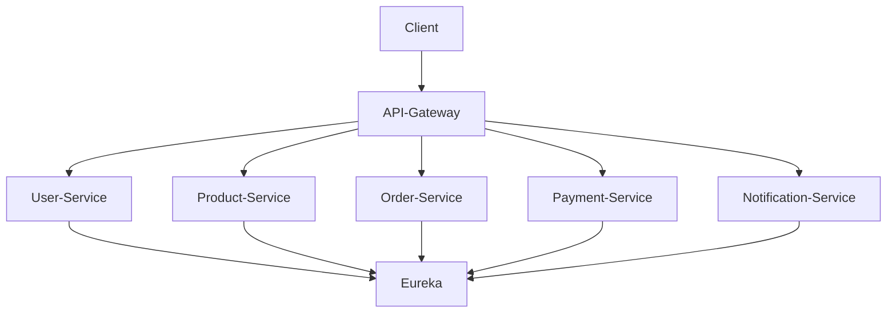

# 🚀 Spring Boot Microservices Platform

Cloud-native microservices platform built using **Spring Boot, Spring Cloud, Eureka, API Gateway, OpenFeign, Docker, Kubernetes, and AWS**.
This project demonstrates **end-to-end microservices communication**, service discovery, and containerization.

---

# 🏗️ Architecture Diagram



---

# 📦 Services Overview

| Service              | Port | Description             |
| -------------------- | ---- | ----------------------- |
| discovery-server     | 8761 | Eureka service registry |
| api-gateway          | 8080 | API Gateway routing     |
| user-service         | 8081 | User management         |
| product-service      | 8082 | Product catalog         |
| order-service        | 8083 | Order processing        |
| payment-service      | 8084 | Payment handling        |
| notification-service | 8085 | Notifications           |

---

# 📁 Project Structure

```
springboot-microservices-platform
├── api-gateway
├── user-service
├── product-service
├── order-service
├── payment-service
├── notification-service
├── kubernetes
├── docs
└── README.md
```

---

# 🛠️ Tech Stack

* Java 17
* Spring Boot
* Spring Cloud Gateway
* Eureka Service Discovery
* OpenFeign
* Spring Data JPA
* H2 Database
* Docker
* Kubernetes
* AWS
* Maven

---

# ✨ Features

✅ Microservices architecture
✅ API Gateway routing
✅ Eureka service discovery
✅ Feign client communication
✅ Order with multiple products
✅ Separate database per service
✅ Docker containerization
✅ Load-balanced routing via gateway
✅ Cloud-native design

---

# 🔗 API Endpoints

## Create Product

```
POST /products
```

```json
{
  "name": "iPhone",
  "description": "Apple phone",
  "price": 80000,
  "stock": 10
}
```

---

## Get Products

```
GET /products
```

---

## Create Order

```
POST /orders
```

```json
{
  "userId": 1,
  "items": [
    {
      "productId": 1,
      "quantity": 2
    }
  ]
}
```

---

# 🚀 Services & Ports

| Service              | URL                                            |
| -------------------- | ---------------------------------------------- |
| API Gateway          | [http://localhost:8080](http://localhost:8080) |
| User Service         | [http://localhost:8081](http://localhost:8081) |
| Product Service      | [http://localhost:8082](http://localhost:8082) |
| Order Service        | [http://localhost:8083](http://localhost:8083) |
| Payment Service      | [http://localhost:8084](http://localhost:8084) |
| Notification Service | [http://localhost:8085](http://localhost:8085) |
| Eureka Server        | [http://localhost:8761](http://localhost:8761) |

---

# 🐳 Run Using Docker

Build jars

```bash
mvn clean package
```

Run containers

```bash
docker-compose up --build
```

---

# ⚙️ Requirements

Install:

* Java 17
* Maven 3.9+
* Git
* IntelliJ IDEA

Verify:

```bash
java -version
mvn -version
git --version
```

---

# ▶️ How to Run Services (Local)

Start services in order:

1. discovery-server
2. product-service
3. user-service
4. order-service
5. payment-service
6. notification-service
7. api-gateway

---

# 🌐 Access via API Gateway

```
http://localhost:8080/users
http://localhost:8080/products
http://localhost:8080/orders
http://localhost:8080/payments
http://localhost:8080/notifications
```

---

# ⚡ API Gateway Configuration

```yaml
server:
  port: 8080

spring:
  application:
    name: api-gateway

  cloud:
    gateway:
      routes:

        - id: user-service
          uri: http://localhost:8081
          predicates:
            - Path=/users/**

        - id: product-service
          uri: http://localhost:8082
          predicates:
            - Path=/products/**

        - id: order-service
          uri: http://localhost:8083
          predicates:
            - Path=/orders/**
```

---

# ❤️ Health Check

```
http://localhost:8081/actuator/health
http://localhost:8082/actuator/health
http://localhost:8083/actuator/health
```

---

# 🔮 Future Enhancements

* Circuit Breaker (Resilience4j)
* Config Server
* Distributed tracing
* Kubernetes deployment
* Authentication (JWT)
* Centralized logging
* Kafka event-driven communication

---

# 🎯 Project Goal

This project demonstrates:

* Microservices architecture
* API Gateway routing
* Service discovery
* Cloud-native design
* Docker containerization
* Kubernetes readiness
* Interview-ready architecture

---

# 👩‍💻 Author

**Anupama Singh**
Senior Java Developer

Spring Boot | Microservices | SAP Commerce | AWS
